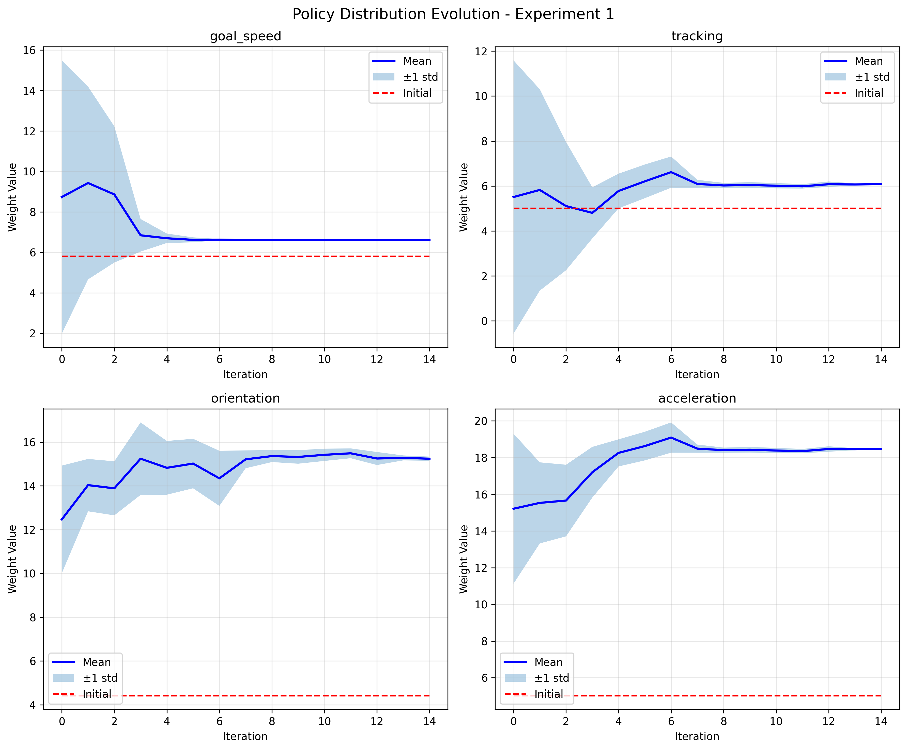
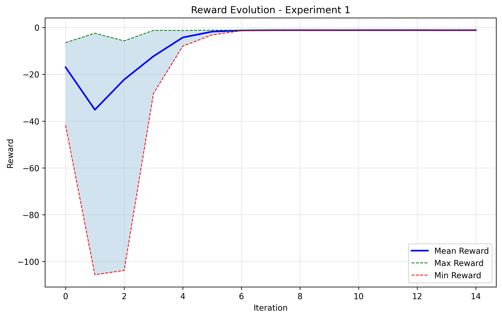
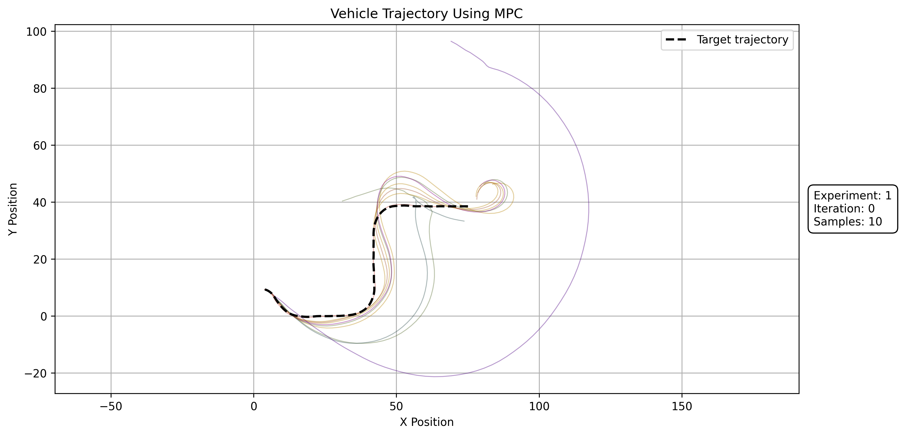
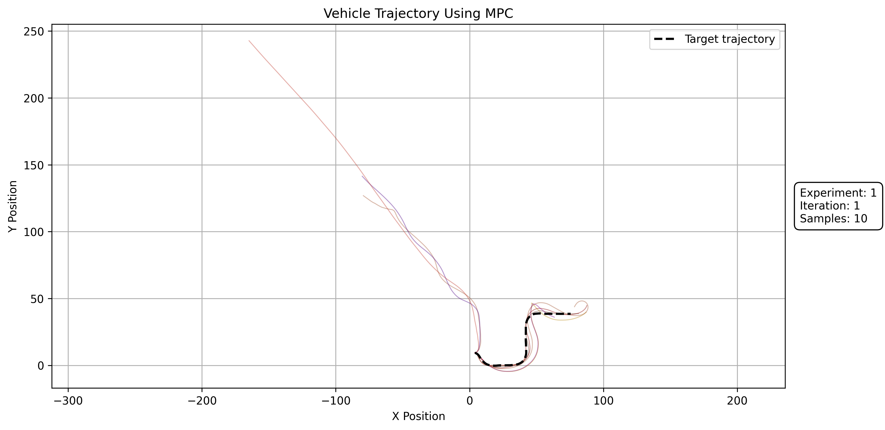
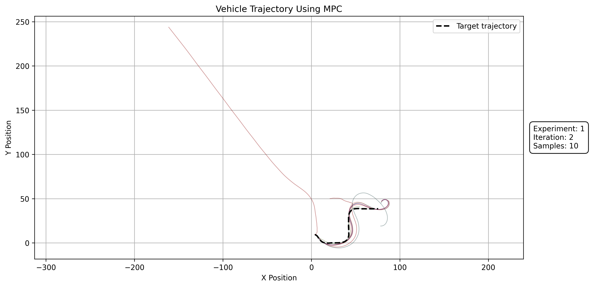
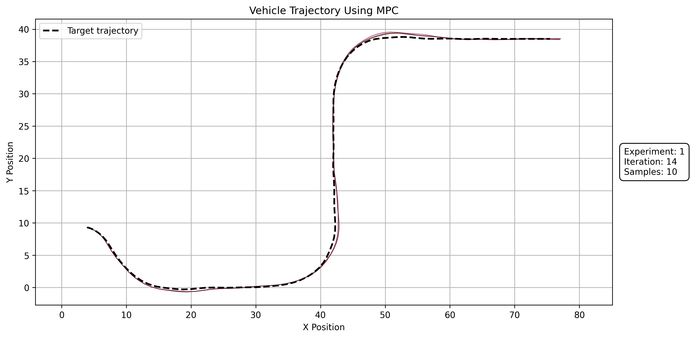
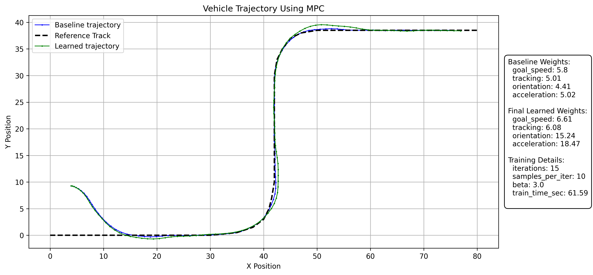

# MPC-Tune
---

## Introduction
MPC-Tune fine-tunes the cost-function weights of a **Model Predictive Controller (MPC)** using **Expectation Maximisation (EM)**-based probabilistic policy search, where a **reward function** guides the tuning process.

MPC-Tune Initialization:
- User chooses a population size `N`.
- User defines a reward function. (This is any metric that is defined over the MPC trajectroy)
- User defines an initial Gaussian policy over the weight space by choosing appropriate $\mu$ & $\sigma$ for all learnable weights. (The gaussian policy is iteratively updated)

MPC-Tune Operation:
- At each iteration, a population of `N` weight vectors is sampled from the Gaussian policy, the MPC is rolled out for each weight vector and the respective rewards are computed. 
- The EM update step re-fits the Gaussian to the best-performing samples, adjusting the policy mean towards the weights with the highest rewards.


---

## Project Structure

```
MPC-Tune/
├── example/
│   ├── main.py                              # Entry point — runs all experiments
│   ├── driving_imitation.py                 # DrivingImitation
│   ├── mpc/
│   │   └── traffic/
│   │       ├── dynamics.py                  # Vehicle dynamics model
│   │       ├── mpc.py                       # MPC solver
│   │       ├── mpc_config.py                # MPC parameters
│   │       └── simulate.py                  # MPC rollout entry point
│   └── plot/
│       └── plotting_trajectory.py            # Trajectory plotting functions
├── src/
│   ├── policy/
│   │   └── Policy.py                        # Policy, BasePolicySearch (ABC)
│   └── utils/
│       └── plotting.py                      # Reward and history plotting functions
├── requirement.txt                          # Third-party dependencies
└── pyproject.toml                           # Package build configuration and editable install
```

### Key module: `src/policy/Policy.py`

The policy search logic is built around an abstract base class that makes it easy to extend to new domains:

```
BasePolicySearch  (ABC)
│
│  @abstractmethod  reward(sampled_trajectory) -> float
│  @abstractmethod  policy_search(initial_state, max_iter, beta, **kwargs)
│
└── DrivingImitation  (example/driving_imitation.py)
        Implements reward as negative mean Euclidean distance to a target trajectory.
        Runs MPC rollouts in parallel using multiprocessing.Pool.
```

**To implement a new domain**, subclass `BasePolicySearch` and provide your own `reward` and `policy_search`:

```python
from policy.Policy import BasePolicySearch
import numpy as np

class MyPolicySearch(BasePolicySearch):

    def reward(self, sampled_trajectory: np.ndarray) -> float:
        # define your own reward signal
        ...

    def policy_search(self, initial_state, max_iter, beta, **kwargs):
        # implement your own search loop using self.policy
        ...
```

The `self.policy` instance (a `Policy` object) provides `sample()`, `update()`, and `expectation()` — so you only need to define the reward and loop logic.

---

## Setup 

**1. Clone the repository**

```bash
git clone https://github.com/ARC-ITU/MPC-Tune
cd MPC-Tune
```

**2. Create and activate a virtual environment**

```bash
python -m venv venv
source venv/bin/activate
```

> On Windows use: `venv\Scripts\activate`

**3. Install dependencies**

```bash
pip install -r requirement.txt
```

**4. Install the package in editable mode**

```bash
pip install -e .
```

This registers `policy` and `utils` as local packages so all imports resolve correctly without modifying `PYTHONPATH`.

**5. Run experiments**
`Example: Driving Imitation`
Both output folders must exist before running:

```bash
python3 example/main.py \
  --progress-plots /path/to/progress_plots \
  --example-folder /path/to/example_folder
```

| Argument | Contents |
|---|---|
| `--progress-plots` | policy evolution, rewards, initial distribution |
| `--example-folder` | trajectory, summary, `progress_over_iterations/` |


---

## Results

### Experiment

| | Weights |
|---|---|
| **Baseline** | `goal_speed: 5.8, tracking: 5.01, orientation: 4.41, acceleration: 5.02` |
| **Learned**  | `goal_speed: 6.61, tracking: 6.08, orientation: 15.24, acceleration: 18.47` |

### Policy Evolution



> Red line represents the Baseline weights.

### Reward



### Sampled Trajectory Over the Iterations

<table>
  <tr>
    <td align="center"><b>Initial</b><br></td>
    <td align="center"><b>After 1 Iteration</b><br></td>
  </tr>
  <tr>
    <td align="center"><b>After 2 Iterations</b><br></td>
    <td align="center"><b>After 14 Iterations</b><br></td>
  </tr>
</table>

### Final Learned Weight's Trajectory


